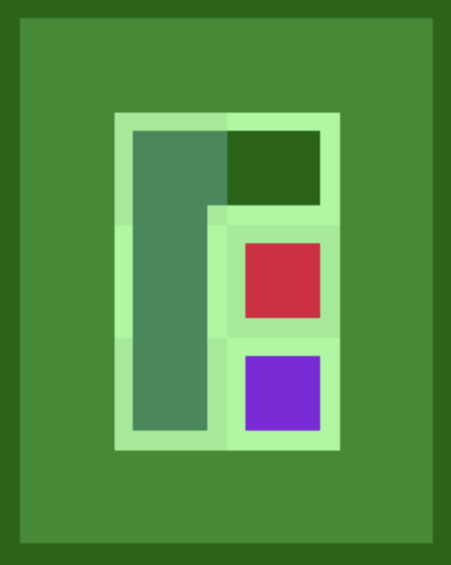
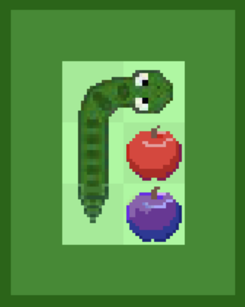
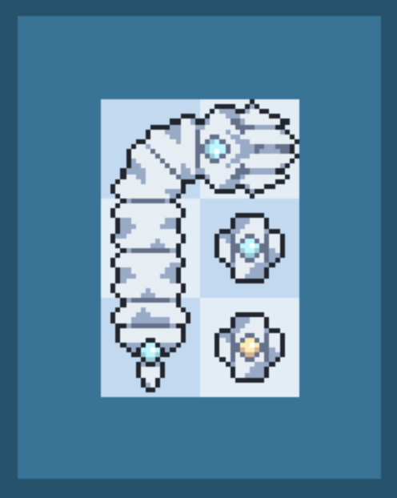
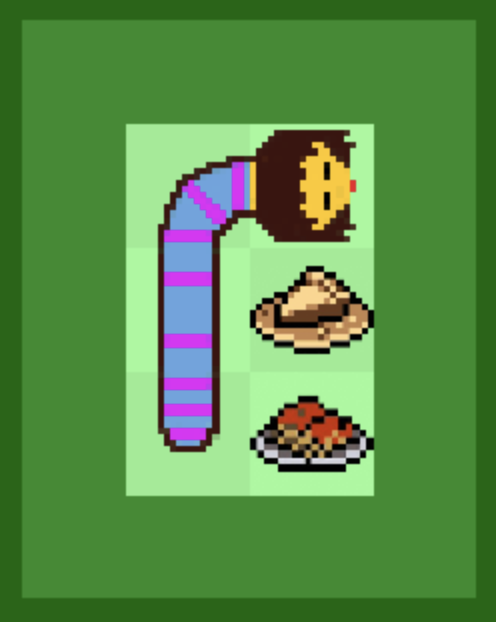

# Snake Game Web
This is the web version of my original project, Snake Game, optimized to be display on Github Pages. For the original, pygame project, go to https://github.com/rawsie-dev/snake-pygame.

A classic Snake game built with Pygame as a school class project. Features numerous modes, difficulties, skins, and secret easter eggs!

## Running this game:
- Go to https://rawsie.dev/snake/.
- Wait for the project to load.
- Tap the screen to begin.

## Controls
Arrow keys or WASD to control the Snake in the main game. Does not yet support mobile controls.

## Settings
### Speed
**Slow**: Slow speed

**Medium**: Medium speed

**Fast**: Fast speed

### Mode
**Normal**: You can't wrap from one side of the border to the opposite.

**Loop**: You can wrap from one side of the border to the opposite.

### Challenge
**Landmine**: Every time the Snake eats an Apple, a landmine appears.

**Blackout**: You only see in a square radius of 4 tiles in 4 directions.

**Poison**: Has a 50% chance that the Apple spawn is a Poisoned Apple, which inverts your controls.

**Motion**: The Apple bounces around the screen.

**Reversal**: Every time the Snake eats an Apple, the Snake reverses its direction (the head becomes the tail and the tail becomes the head).

### Board Height
Change the board height (from 3 to 40) using the slider.

### Board Width
Change the board width (from 3 to 50) using the slider.

### Skin
Change the skin using the arrows.

### Volume
Change the volume using the slider.

### Music
Enable or disable the music.

### Sound effects
Enable or disable the sound effects.

## Skins
### Skin 1 (Plain)

### Skin 2 (Default)

### Skin 3 (Bonesaw)

### Skin 4 (Frisk)

## Easter eggs

- Click the "Poison" button in Challenge 3 to 5 times. Press play after the button changes text.
- Set the Board Height to 4 and Board Width to 20.
- Set the Board Height to 6 and Board Width to 9.
- Set the Board Height to 5 and Board Width to 30.
- Set the Volume to 69.
- Press Up Up Down Down Left Right Left Right B A then select the Plain snake skin. Press play.
- Press [Up Up Down Down Left Right Left Right B A] 3 times. Press play.
- Set the Board Height to 9, Board Width to 9, Volume to 99, select the Frisk skin. Then close the game (either by pressing esc, closing the window or quitting).
